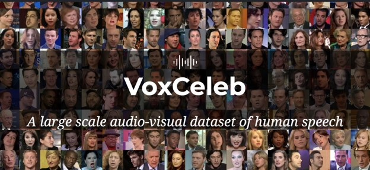

# This_is_KNN

KNN stores the entire training dataset which it uses as its representation. KNN does not learn any model. KNN makes predictions just-in-time by calculating the similarity between an input sample and each training instance. There are many distance measures to choose from to match the structure of your input data. That it is a good idea to rescale your data, such as using normalization, when using KNN.

This repository is part of my contribution to a group project. That repo was made private but here are the details:

# Final Project - UT Data Science Bootcamp
Title: Study of ML models for Voice Analysis

Team: Bharath, Choi, Christy, Mary, Roberto and Wini

Goal: Analyze suitability of different Machine Learning models for voice analysis (Gender and Identity)

Full dataset: 100,000 voice samples

*High Level Plan:*

1. Take a small subset 1000 files, convert audio to numpy array, scaling + normalization - Bharath
2. Split into train (900) vs test (100) - Bharath
3. Each of us works on building one of these models -
Bharath : Bayesian
Choi : Support Vector Machine
Christy : Decision Tree
Mary : KNN
Roberto : Linear regression
Wini : CNN
4. Run the models on data and evaluate loss and accuracy
5. Expand dataset to as large as we can handle
6. Plot and analyze the suitability of these models for gender/identity detection

